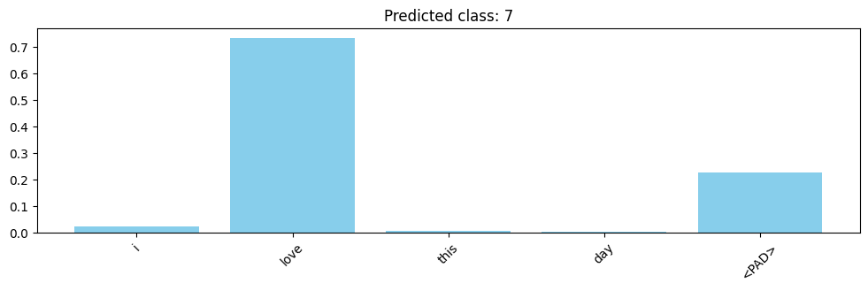

# 🎭 Attention-based Sentiment Analysis

This project implements an **emotion classification model** using an **Attention mechanism with BiLSTM** on a Twitter dataset.  
The model learns to classify tweets into multiple emotions such as **sadness, worry, enthusiasm, surprise, neutral**, and more,  
while also highlighting the important words contributing to each prediction through the attention mechanism.

---

## 🚀 Features

- Preprocessing of IMDB dataset (tokenization, padding, vocabulary building)
- Word embeddings using PyTorch
- **BiLSTM + Attention mechanism** for better interpretability
- Attention visualization to see which words the model focuses on
- Achieved **high accuracy** on test data

---

## 📂 Project Structure

├── Attention.ipynb # Jupyter Notebook with full code

├── emotions.csv # Tweets Dataset

├── requirements.txt # Dependencies

└── README.md # Project documentation

---

## ⚙️ Installation & Usage

### 1. Clone the Repository
```bash
git clone https://github.com/AbhijithBabu12/tweet-emotion-bilstm-attention
cd tweet-emotion-bilstm-attention
```
### 2. Install Dependencies
```bash
pip install -r requirements.txt
```

---

## 🛠️ Technologies Used

⚙️Python

⚙️PyTorch

⚙️Torchtext / Custom Tokenizer

⚙️Matplotlib (for visualization)

⚙️Google Colab / Jupyter Notebook

---

## 📊 Results

❤️Training Accuracy: 99%

---
## 🖼 Output Screenshot

**Example Used :**

*"i **love** this day"*

<p align="center">
  
</p>

---

## 🔍 Attention Visualization

The model highlights important words contributing to sentiment prediction:

**👍Positive Example:**

*"The movie was **amazing**, with **great** acting and a **wonderful** story."*

**👎Negative Example:**

*"This was a **terrible** film, with **boring** characters and a **weak** plot."*

---

## 👨‍💻 Author

Abhijith Babu
Passionate about ML & AI 🚀

📌 GitHub: [https://github.com/AbhijithBabu12]

📌 LinkedIn: [https://www.linkedin.com/in/abhijith-babu-856170201/]
